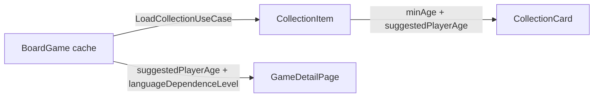

# Design: Show suggested player age and language dependence from thing API

## Approach

Both requested values (`suggestedPlayerAge`, `languageDependenceLevel`) are already fetched from `/xmlapi2/thing` and stored in the `BoardGame` cache. The collection list, however, only works with `CollectionItem` objects. To avoid loading every cached `BoardGame` into the collection BLoC state, we extend the existing merge step in `LoadCollectionUseCase` that already copies best/recommended player counts from `BoardGame` into each `CollectionItem`.

## Data flow

## Entity / persistence changes

1. Add `String? suggestedPlayerAge` to `CollectionItem`.
2. Add a nullable `TextColumn suggestedPlayerAge` to the `CollectionItems` Drift table.
3. Bump `schemaVersion` from `13` to `14` and add a migration that adds the new column.
4. Regenerate `app_database.g.dart` with `build_runner`.

`minAge` is **not** duplicated in `CollectionItems`; it already exists there from the collection API. `LoadCollectionUseCase` back-fills `item.minAge` from `BoardGame.minAge` only when the collection API did not provide it. The `/xmlapi2/thing` parser reads `minage` from the `value` attribute (`<minage value="10"/>`), not from element text, so the cached `BoardGame.minAge` is actually populated.

## Use-case change

`LoadCollectionUseCase` already loads the matching `BoardGame` rows. After the existing player-count merge, it will also perform:

- `minAge`: copy from `BoardGame` only when `item.minAge == null`.
- `suggestedPlayerAge`: copy from `BoardGame` whenever present.

`SyncCollectionUseCase` enriches newly synced collection items with `minAge` and `suggestedPlayerAge` from the cached or freshly fetched `BoardGame` before saving them. This ensures that the age line is visible immediately after a sync even when the collection endpoint does not provide the value.

### Refreshing stale cached `BoardGame` rows

`SyncCollectionUseCase._fetchMissingDetails` already refreshes cached `/thing` details when they are missing a description, `detailsUpdatedAt`, or best/recommended player-count ranges. It now also treats a cached `BoardGame` as incomplete when:

- `minAge` is missing, or
- `suggestedPlayerAge` is missing.

This guarantees that users with older cached game rows get the missing age data on the next sync instead of being stuck with a permanently empty age line.

## UI changes

### Collection card

The existing `CardField.minAge` line is updated to:

- Use `item.minAge` (now guaranteed to contain the cached thing value when the collection item lacks it).
- Append `item.suggestedPlayerAge` inline when available, using a `thumbs_up` icon (`Icons.thumbs_up` / `Icons.thumb_up`) and a small separator.
- Render as `Min age: 8 · 👍 10` (the exact spacing is handled by the localization/widget, not a hard-coded string).

### Game detail

`_DetailFields._buildFields` is updated to insert:

1. A new minimum-age row that behaves like the card line (base minimum age + suggested age with thumbs-up icon).
2. A new language-dependence row that maps the stored level string (`"1"`–`"5"`) to a human-readable label.

The language-dependence row is placed near the other static game metadata, after the plays row.

### Player-count row

`_formatPlayerCount` returns only the base player-count text. Recommended and best counts are rendered as a suffix widget (`_PlayerCountSuffix`) that uses the same icon language as the collection card: thumbs-up for recommended and trophy for best. The suffix is separated from the base value by the same dot separator used for the suggested age.

## Localization

New keys:

- `detailMinAgeLabel(int age)` — e.g. `Min age: {age}`
- `detailLanguageDependenceLevel1` … `detailLanguageDependenceLevel5`
- Re-use the existing `cardMinAgeLabel` for the card and append the suggested age via a separate helper/widget rather than a new localization key.

## Out of scope

- No new filters or sort criteria.
- No changes to `CardLayoutConfig`; `CardField.minAge` remains the single toggle that controls both minimum and suggested age.
